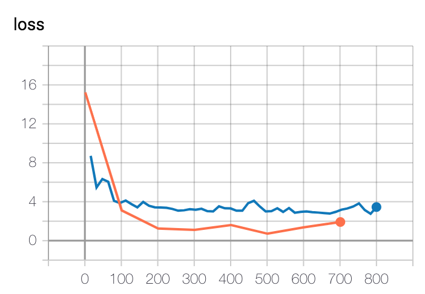
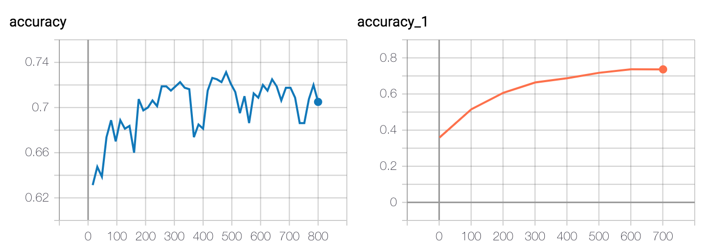

# indoor-outdoor-classification

### Dataset
Fourteen indoor and fourteen outdoor videos were manually selected from the examples on the [YouTube-8M web page](https://research.google.com/youtube8m/explore.html). URLs are contained in [data/indoor.txt](data/indoor.txt) and [data/outdoor.txt](data/outdoor.txt).

Scripts for downloading the videos and extracting frames are in the [data](data) directory and require that `youtube-dl` and `ffmpeg` are installed. 

* [0\_download\_videos.sh](data/0_download_videos.sh): Downloads each video using `youtube-dl`. Videos are downloaded in their native format.
* [1\_extract\_frames.sh](data/1_extract_frames.sh): Extracts PNG frames each video using `ffmpeg`. Skips the first and last 15% of the video to minimize intro/outro frames and extracts 100 linearly spaced frames from the remaining video to maximize variance across frames.

Frame names contain the md5 hash of the native video for cross-validation purposes. For reproducibility, the frame dataset is available at [https://drive.google.com/open?id=1EtWs_8meh67vC5pSwJXqkQLW2-y_BoUt](https://drive.google.com/open?id=1EtWs_8meh67vC5pSwJXqkQLW2-y_BoUt).

### Model
##### Training
A 50-layer ResNet pre-trained on ILSVRC-2012 was used for transfer learning, trained for 50 epochs at a learning rate of 0.001. Images are resized to 448x448 pixels without preserving the aspect ratio. During training, random 224x224 crops are taken from the larger 448x448 image with random horizontal mirroring. During evaluation, a single 224x224 center-crop is taken from the larger 448x448 image. 

The dataset is split into 20 videos for training (10 indoor, 10 outdoor) and 8 videos for testing (4 indoor, 4 outdoor). The model trains to ~70% accuracy on the test set. Loss and accuracy for the train (orange) and test (blue) sets are shown below.

 

Training was performed on Google Colab using TensorFlow ([notebook](notebooks/training.ipynb)). The final model exported in TensorFlow SavedModel format is located in the [outdoornet](outeodornet) directory.

##### Limitations
The primary limitation in performance is likely due to the lack of variability in the dataset. Different train/test splits produced large fluctuations in accuracy suggesting that they come from different data distributions.

### Classification
A sample pipeline for classification is implemented in the [classification](classification) directory. This pipeline uses TensorFlow Serving and should be run through Docker.

##### Instructions
1. Make sure docker is installed and running.
2. Run `pip install -r docker/requirements.txt` to install client-side dependencies.
3. Run `./classify.sh [image1] [image2] ...`, which starts TensorFlow Serving in a docker container and makes classification requests.

Two test images from each video in the test set are located in [images/test](images/test). For example, running `find images/test/**/*.png | xargs ./classify.sh` should print:

```
images/test/indoor/6ce124f8e1eeb811a0a4fe3e8451efbd-001.png: Indoor (outdoor: 0.0000, indoor: 1.0000)
images/test/indoor/6ce124f8e1eeb811a0a4fe3e8451efbd-100.png: Indoor (outdoor: 0.0000, indoor: 1.0000)
images/test/indoor/90a5d63d12fc15d0ddf79f70e9662a4d-001.png: Indoor (outdoor: 0.0002, indoor: 0.9998)
images/test/indoor/90a5d63d12fc15d0ddf79f70e9662a4d-100.png: Indoor (outdoor: 0.0074, indoor: 0.9926)
images/test/indoor/a7afe27c0146ef29677ba904d42d8984-001.png: Indoor (outdoor: 0.0000, indoor: 1.0000)
images/test/indoor/a7afe27c0146ef29677ba904d42d8984-100.png: Outdoor (outdoor: 0.9993, indoor: 0.0007)
images/test/indoor/f8c5516ae32afec4ee04417dac06edf0-001.png: Indoor (outdoor: 0.0001, indoor: 0.9999)
images/test/indoor/f8c5516ae32afec4ee04417dac06edf0-100.png: Indoor (outdoor: 0.0000, indoor: 1.0000)
images/test/outdoor/0cdc1fe2961537f7deddee943c795114-001.png: Indoor (outdoor: 0.0000, indoor: 1.0000)
images/test/outdoor/0cdc1fe2961537f7deddee943c795114-100.png: Outdoor (outdoor: 1.0000, indoor: 0.0000)
images/test/outdoor/14e796072f6c63169abcc3b50303b71f-001.png: Outdoor (outdoor: 0.9646, indoor: 0.0354)
images/test/outdoor/14e796072f6c63169abcc3b50303b71f-100.png: Outdoor (outdoor: 1.0000, indoor: 0.0000)
images/test/outdoor/368b2dc5cbb2179f9efa559e30eff2b1-001.png: Outdoor (outdoor: 0.8027, indoor: 0.1973)
images/test/outdoor/368b2dc5cbb2179f9efa559e30eff2b1-100.png: Outdoor (outdoor: 0.9997, indoor: 0.0003)
images/test/outdoor/42b05d211690ad49dc353e2af263acb5-001.png: Outdoor (outdoor: 1.0000, indoor: 0.0000)
images/test/outdoor/42b05d211690ad49dc353e2af263acb5-100.png: Outdoor (outdoor: 0.5865, indoor: 0.4135)
```

##### Tests
Unit tests are located in the [tests](tests) directory and are run using pytest. To test through docker, run `docker-compose build image` followed by `docker-compose run test`.

